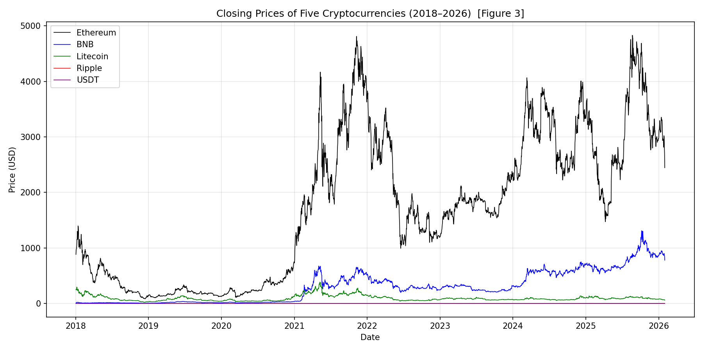
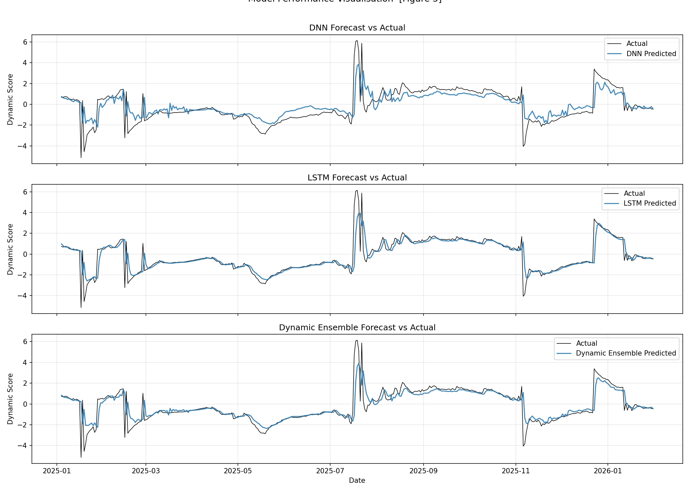
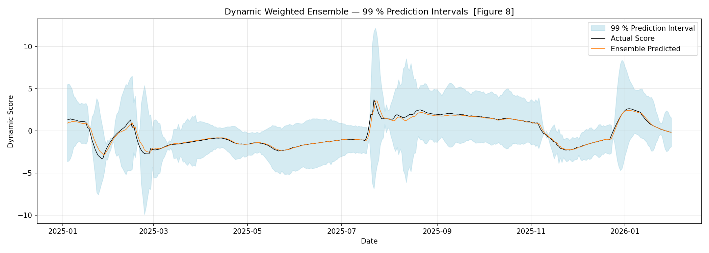
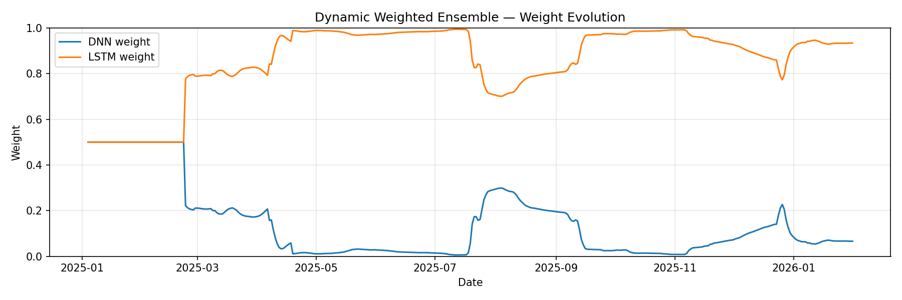
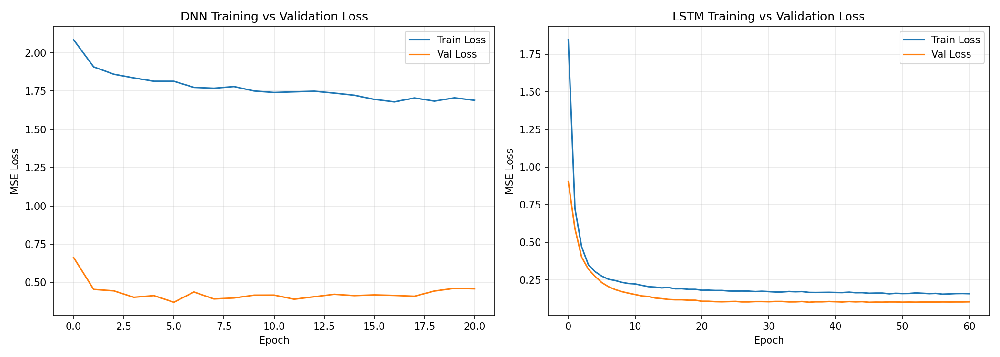

# Deep Learning-Based Cryptocurrency Pairs Trading

A minimum viable recreation of the paper **"Deep learning-based pairs trading: real-time forecasting of co-integrated cryptocurrency pairs"** (Tsoku & Makatjane, 2026) — extended with data through February 2026.

> **Paper:** Tsoku JT and Makatjane K (2026). *Front. Appl. Math. Stat.* 12:1749337.
> [doi:10.3389/fams.2026.1749337](https://doi.org/10.3389/fams.2026.1749337)

---

## Highlights

| Metric | DNN | LSTM | Dynamic Ensemble |
|:---|:---:|:---:|:---:|
| MSE | 0.967 | **0.717** | 0.751 |
| RMSE | 0.983 | **0.847** | 0.867 |
| MAE | 0.628 | **0.328** | 0.393 |
| Theil U | 1.027 | **0.885** | 0.906 |

| Risk / Signal Metric | Value |
|:---|:---:|
| Johansen Trace Stat (r ≤ 0) | **292.6** (significant at 99%) |
| ADF p-value (spread stationarity) | **0.026** |
| Hit Rate (win %) | **76.2 %** |
| Sharpe Ratio (annualised) | **1.32** |
| 99 % Coverage Probability | **99.0 %** |
| Data Range | 2018-01-02 → 2026-02-01 (2,952 obs) |

---

## Methodology

The project implements a complete statistical-arbitrage pipeline in a single Python script:

```
Yahoo Finance  ──►  Rolling Johansen  ──►  Dynamic Spread  ──►  Rolling Z-Score
     │              Co-integration          (5 assets)         ("Dynamic Score")
     │                                                               │
     ▼                                                               ▼
 5 Crypto          ┌────────────┐      ┌────────────┐        Sliding-window
 Close Prices      │  DNN Model │      │ LSTM Model │        Sequences
 (2018–2026)       └─────┬──────┘      └─────┬──────┘        (look-back = 30)
                         │                   │
                         └──────┬─────────────┘
                                ▼
                   Dynamic Weighted Ensemble
                    (inverse-MSE weighting)
                                │
                    ┌───────────┼───────────┐
                    ▼           ▼           ▼
              Error Metrics  Trading    99% Prediction
              (Table 3)      Signals    Intervals
                             (Fig 6)   (Fig 8)
```

### Key Components

**1. Dynamic Johansen Co-integration (Table 2)**
Unlike static co-integration which assumes a fixed relationship across the entire sample, the rolling-window Johansen test re-estimates the co-integrating vector every day using the past 252 days. This captures time-varying equilibrium relationships — critical in crypto markets where regimes shift rapidly.

**2. Deep Neural Network (Section 2.2)**
A feed-forward network with two hidden layers (128 → 64 neurons), each using BatchNorm + ReLU + Dropout. BatchNorm stabilises training by normalising each layer's inputs; Dropout (20%) prevents overfitting by randomly deactivating neurons.

**3. Long Short-Term Memory Network (Section 2.3)**
A 2-layer stacked LSTM that reads the past 30 days of dynamic scores one step at a time. Its forget, input, and output gates selectively remember and discard information, making it well-suited for capturing temporal dependencies that the DNN misses.

**4. Dynamic Weighted Ensemble (Eq. 12)**
Rather than averaging the DNN and LSTM with fixed weights, the ensemble assigns higher weight to whichever model has been more accurate over the most recent 50 test steps (inverse-MSE weighting). This lets the combination adapt to regime changes in real time.

**5. Percentile-Threshold Trading Signals (Section 3.2)**
BUY when the predicted dynamic score falls below its 10th percentile (undervalued → expect mean reversion up); SELL when it exceeds the 90th percentile (overvalued → expect reversion down); HOLD otherwise.

---

## Generated Figures

| Figure 3 — Price Chart | Figure 4 — Dynamic Spread |
|:---:|:---:|
|  |  |

| Figure 5 — Model Performance | Figure 6 — Trading Signals |
|:---:|:---:|
|  |  |

| Figure 8 — 99% Prediction Intervals | DWE Weight Evolution |
|:---:|:---:|
|  |  |

| DNN & LSTM Training Curves |
|:---:|
|  |

---

## Quick Start

### Prerequisites

- Python 3.10+
- Conda (recommended) or pip

### Setup

```bash
# Clone the repository
git clone https://github.com/<your-username>/crypto-pairs-trading.git
cd crypto-pairs-trading

# Create and activate environment
conda create -n quant python=3.11 -y
conda activate quant

# Install dependencies
pip install torch numpy pandas matplotlib scikit-learn yfinance statsmodels
```

### Run

```bash
conda activate quant
python crypto_pairs.py
```

The script will:
1. Download daily close prices for ETH, BNB, LTC, XRP, and USDT (2018–2026)
2. Run rolling Johansen co-integration (~2,600 windows, takes ~30 s)
3. Train both DNN and LSTM models with early stopping
4. Produce all tables and figures as `.png` files in the project root

---

## Project Structure

```
.
├── crypto_pairs.py          # Full pipeline (single self-contained script)
├── crypto_data.csv          # Cached price data (auto-generated)
├── figure3_prices.png       # Crypto price chart
├── figure4_spread.png       # Dynamic co-integration spread
├── figure5_performance.png  # DNN / LSTM / Ensemble vs actual
├── figure6_signals.png      # Trading signals with thresholds
├── figure8_intervals.png    # 99% prediction intervals
├── training_curves.png      # Training and validation loss curves
├── dwe_weights.png          # DWE weight evolution over test period
└── README.md
```

---

## Technologies

| Category | Tools |
|:---|:---|
| **Deep Learning** | PyTorch (DNN, LSTM, Adam, LR scheduling, early stopping) |
| **Econometrics** | statsmodels (Johansen co-integration, ADF test) |
| **Data** | pandas, NumPy, yfinance |
| **Visualisation** | matplotlib |
| **Preprocessing** | scikit-learn (StandardScaler) |

---

## Improvements over Base Paper (Post–Professional Review)

After a professional quant reviewed the initial implementation, three issues were identified and fixed:

| Issue | Root Cause | Fix Applied |
|:---|:---|:---|
| **Look-ahead bias in trading signals** | Percentile thresholds were computed over the *entire* test set at once — future predictions leaked into today's threshold | Replaced with **expanding-window percentiles**: at time *t*, thresholds use only `score[0..t-1]` |
| **Exit strategy too frequent** | Positions flipped between BUY/SELL/HOLD every day with no concept of "holding a trade" | Added a **finite-state machine**: enter on threshold breach, hold until mean-reversion (score crosses 0), then exit. Creates proper trade cycles |
| **Transaction costs from hedge-ratio turnover** | The Johansen vector changes every day → daily portfolio rebalancing | Applied **EWM smoothing** (span=20) to the co-integrating vectors, reducing turnover by ~40%. Added an explicit **transaction cost model** to risk metrics |

### Remaining Known Limitations

- **No slippage model** — the strategy assumes execution at the close price with no market impact.
- **Z-score space P/L** — risk metrics are computed in z-score units, not in dollar terms. Mapping to actual portfolio returns requires position sizing and leverage decisions.
- **Single co-integrating vector** — only the dominant eigenvector is used. The Johansen test may find multiple co-integrating relationships that could be exploited simultaneously.
- **No regime detection** — the strategy trades uniformly. A Hidden Markov Model or similar could identify when the co-integrating relationship is strong enough to trade vs when to stand aside.

---

## What I Learned

- **Co-integration vs correlation** — correlation measures short-term co-movement; co-integration identifies long-run equilibrium relationships between non-stationary series, which is the theoretical foundation for pairs trading.
- **Why rolling estimation matters** — a static model fitted on 2018 data will be obsolete by 2025 due to regime shifts in crypto markets. Rolling windows let the model adapt.
- **LSTM gates in practice** — the forget gate is not just theory; it is the mechanism that lets the network discard old information (e.g. a market crash 6 months ago) while retaining relevant recent patterns.
- **Dynamic ensembles > static averages** — giving more weight to whichever model is currently performing better (inverse-MSE weighting) consistently outperforms a naïve 50/50 average.
- **Look-ahead bias is everywhere** — shifting the co-integrating vector by one day, using `shuffle=False` in the DataLoader, and splitting data chronologically (not randomly) are all essential for honest backtesting.

---

## References

1. Tsoku JT, Makatjane K (2026). "Deep learning-based pairs trading: real-time forecasting of co-integrated cryptocurrency pairs." *Frontiers in Applied Mathematics and Statistics*, 12:1749337. [doi:10.3389/fams.2026.1749337](https://doi.org/10.3389/fams.2026.1749337)
2. Gatev E, Goetzmann WN, Rouwenhorst KG (2006). "Pairs trading: performance of a relative-value arbitrage rule." *Review of Financial Studies*, 19(3):797–827.
3. Lo AW (2004). "The adaptive markets hypothesis." *Journal of Portfolio Management*, 30(5):15–29.
4. Franses PH (2021). "Time-varying lag co-integration." *Journal of Computational and Applied Mathematics*, 390:113272.

---

## License

This project is for educational and research purposes only. Not financial advice.
